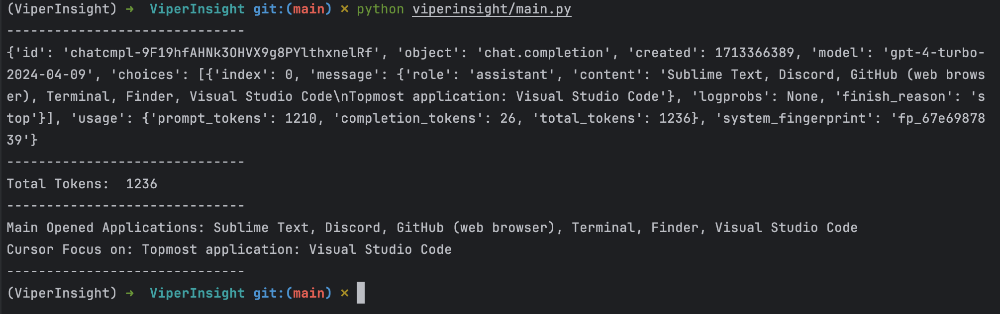

# Viper Insight
ViperInsight is a powerful tool that leverages computer vision and machine learning to provide in-depth insights into your daily screen time usage. Inspired by the keen senses of the viper snake, this repository combines screenshot analysis and intelligent vision models to track, categorize, and report on how you interact with your digital devices.

ViperInsight slithers through your digital life, shedding light on your screen time habits with the precision and vigilance of its reptilian namesake. Whether you're looking to boost productivity, reduce distractions, or simply better understand your technology usage, ViperInsight is your go-to solution for insightful screen time management.

Let the viper's watchful gaze guide you towards a healthier, more balanced digital lifestyle :)

## Key Features
- Seamless screenshot capture and processing
- Accurate classification of on-screen activities (e.g., productivity, entertainment, social media)
- Detailed reporting on time spent in different application categories
- Historical trend analysis to identify usage patterns over time
- Customizable alerts and notifications to help manage screen time effectively

## Quick Start

```bash
git clone git@github.com:InfiniteAICreations/ViperInsight.git
cd ViperInsight
pip install -r requirements.txt
export OPENAI_API_KEY=sk-proj-1234567890
python viperinsight/main.py
```

The screenshot and response will be saved in the `datasets` directory.

## Use Cases

Screenshot:


Result:


I don't know why it concludes the topmost application is `Visual Studio Code` 🤔

## TODO
- [ ] Add Anthropic API or other powerful multi-models.
- [ ] Fined-tune the prompt.
- [ ] Timing screenshot and analysis.
- [ ] Output statistics.
- [ ] Consider the tokens cost.

## License
Released under the [MIT License](LICENSE).